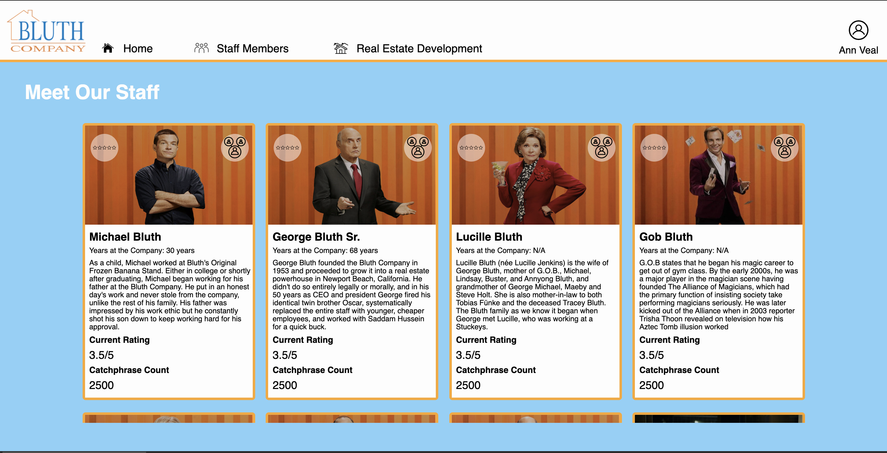
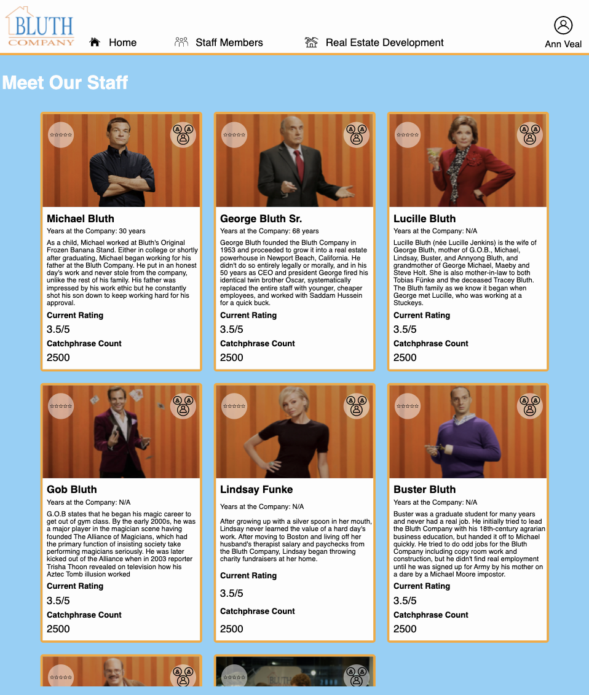
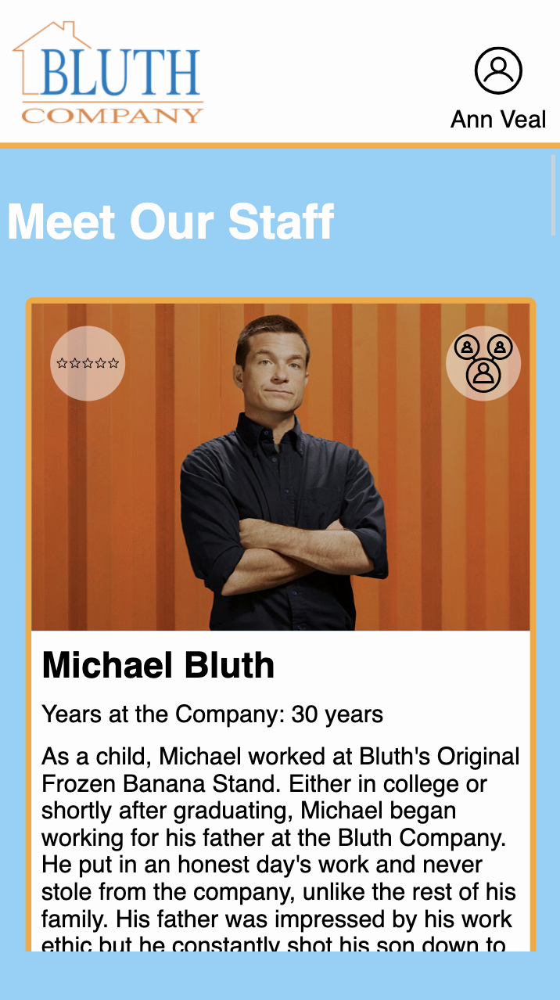
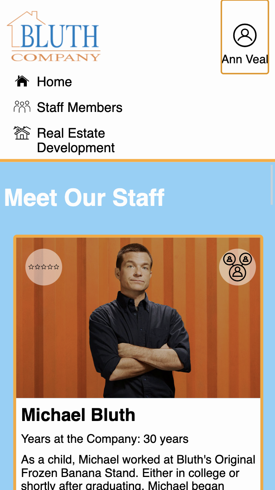

# Static-Comp

## Introduction

_The Bluth Company_ is a real estate development firm founded by George Bluth. We don't know what you heard, but we did not illegally build homes in Iraq. Now... get to know the family and staff through our new website!

### Desktop View

### Tablet View

### Mobile View

### Inspired by:

## Link to the deployed set

https://rdtho2525.github.io/Static-Comp/

## Local install instructions

1. Clone this repo
2. CD into the `Static-Comp`directory
3. Open index.html in your browser

## Contributors

- Reggie Thompson https://github.com/rdtho2525

**The Bluth Company:** _"Solid as a Rock"_
